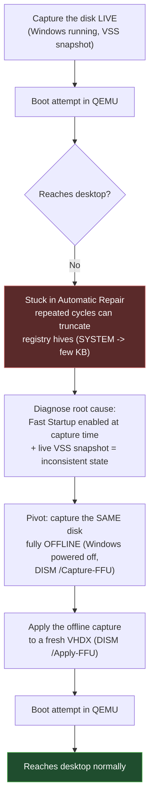
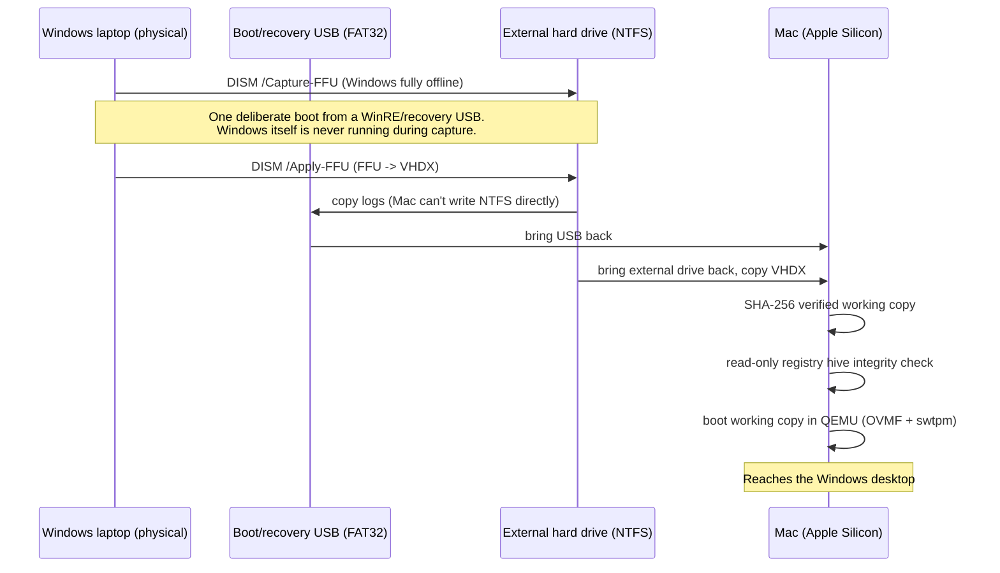

# Windows P2V on Apple Silicon

Boot an existing **x86_64 Windows installation** — the real disk, with all your applications
already installed — inside QEMU/UTM on an **Apple Silicon Mac**, when the obvious approach
(capture the live disk, convert, boot) leaves you stuck in Windows Automatic Repair forever.

This repo is a full write-up plus ready-to-adapt scripts for the fix that actually worked:
**re-capture the same disk fully offline** (Windows completely powered off) instead of capturing
it live. It also documents everything else that was tried and ruled out along the way, because
knowing *why* the obvious approaches fail is what makes the fix make sense.

## The problem in one paragraph

Apple Silicon Macs are ARM64; an existing Windows installation you want to bring over is almost
always x86_64. Since the CPU architectures don't match, there's no hardware-accelerated
virtualization path — only CPU emulation (QEMU's TCG engine). That's slow but works. The real
obstacle isn't the CPU emulation, though: it's that **a live-captured disk image of that Windows
installation may simply refuse to boot**, cycling through Windows's own Automatic Repair forever,
and repeated repair attempts can silently truncate a registry hive to a few KB — making the disk
image steadily *more* broken every time you try. This repo explains why that happens and how to
avoid it entirely.

## The short version



Full diagnostic trail: [`docs/01-problem-and-root-cause.md`](docs/01-problem-and-root-cause.md).

## Is this for you?

This applies if:
- Your Mac is Apple Silicon (M1/M2/M3/M4/M5, ARM64) and your Windows installation is x86_64 —
  i.e. there's an architecture mismatch and you're stuck with CPU emulation either way.
- You want to boot **the actual existing installation** (same disk, same installed apps) — not a
  fresh Windows install with everything reinstalled by hand.
- A live-captured image of that disk (Disk2vhd, or similar) won't boot, or boots into repeated
  Automatic Repair cycles.

It is **not** about getting native-speed virtualization for an x86 guest on ARM — that's not
possible without hardware support. The goal here is a *working* boot, not a fast one.

## How it works, end to end



See [`docs/diagrams/file-transfer-relay.md`](docs/diagrams/file-transfer-relay.md) for *why* the
USB hop is necessary (macOS mounts NTFS read-only by default) and
[`docs/diagrams/pipeline-sequence.md`](docs/diagrams/pipeline-sequence.md) for the fully detailed
version of the diagram above.

## Requirements

- An Apple Silicon Mac with [Homebrew](https://brew.sh) and [OrbStack](https://orbstack.dev) (or
  any Docker Desktop alternative) installed.
- The physical Windows machine, one more time, booted from a WinRE/recovery USB that supports
  `dism /Capture-FFU` (most modern Windows installation media does).
- A USB flash drive (FAT32) and an external hard drive with enough free space for the FFU and the
  resulting VHDX (roughly 2x the used space on the source Windows partition).
- Patience: CPU-emulated boot and large file operations are slow. This is expected.

Full prerequisite checklist: [`docs/02-prerequisites.md`](docs/02-prerequisites.md).

## Quick start

1. Read [`docs/01-problem-and-root-cause.md`](docs/01-problem-and-root-cause.md) — skip the live
   capture entirely and go straight to the offline approach unless you want the full story of why.
2. Mac side setup: [`docs/03-mac-setup.md`](docs/03-mac-setup.md), then copy
   `scripts/mac/config.example.sh` to `scripts/mac/config.sh` and edit it for your paths.
3. Windows side, offline capture: [`docs/04-windows-offline-capture.md`](docs/04-windows-offline-capture.md),
   using `scripts/windows/`.
4. Back on the Mac, verify and boot: [`docs/05-mac-verification-and-boot.md`](docs/05-mac-verification-and-boot.md),
   using `scripts/mac/`.
5. Optional: [`docs/06-promote-to-utm.md`](docs/06-promote-to-utm.md) to turn the QEMU command line
   into a normal UTM VM window.
6. Something not matching what you see? Check [`docs/07-troubleshooting.md`](docs/07-troubleshooting.md)
   first — it covers nine real failures hit while building this, each with its root cause.

## Repo layout

```
docs/                        Full write-up, one topic per file, read in order
docs/diagrams/                Mermaid source for every diagram referenced above
docs/legacy-failed-approach/  The abandoned live-capture path, kept as documented evidence
scripts/mac/                  Run these on the Mac, in numeric order
scripts/windows/              Run these on the Windows recovery media, in numeric order
```

Every script is meant to be read before it's run. They all pause for a typed confirmation before
anything destructive, log what they did, and never guess a disk number or drive letter for you.

## Why keep the failed approach documented?

Section [`docs/legacy-failed-approach/`](docs/legacy-failed-approach/README.md) walks through the
live-capture attempt in full, including the exact tool bugs hit along the way (a `supermin`
missing-kernel error, a heredoc attaching to the wrong command in a pipeline, an NTFS driver
refusing to mount read-write, a `virt-win-reg` alias that silently fails to resolve). If you're
debugging something adjacent to this — not necessarily the exact same problem — that trail is
often more useful than the final answer.

## License

MIT — see [`LICENSE`](LICENSE).
