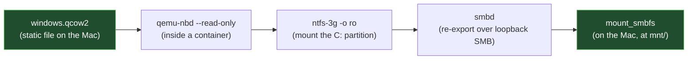

# Reading files without booting the VM

Once your VM boots correctly (see [Mac-side verification and boot](05-mac-verification-and-boot.md)
and, optionally, [promoting it to UTM](06-promote-to-utm.md)), you'll sometimes just want a
handful of files off the C: drive — not a full desktop session. Booting the VM for that is slow:
it's still CPU-emulated (see [the problem writeup](01-problem-and-root-cause.md)), and file
transfer through UTM's shared folder is slow on top of that.

## The idea

The VM's disk is a static file on the Mac's filesystem. As long as the VM itself isn't running,
that file can be read directly — no CPU emulation involved at all, since nothing needs to
execute Windows code, only read its filesystem.

macOS has no built-in way to read a qcow2 disk image or an NTFS partition inside one, so
[`tools/win-disk-reader/`](../tools/win-disk-reader/) does this inside a disposable Linux
container instead (which has all the necessary tools), and bridges the result back to the Mac as
a normal, read-only, mounted folder:



Three independent read-only layers (the container's bind mount, `qemu-nbd --read-only`, and
`ntfs-3g -o ro`) mean there is no path for this to ever write to the real Windows disk — safe to
run against your original VHDX or a working copy alike, though pointing it at a working copy or
the UTM-imported qcow2 is the normal case.

## Using it

See [`tools/win-disk-reader/README.md`](../tools/win-disk-reader/README.md) for the full
mechanism and every command. Short version:

```bash
cd tools/win-disk-reader
cp config.example.env config.env   # edit it for your VM's paths
./win-disk-reader.sh start          # mounts C: read-only at tools/win-disk-reader/mnt/
# ...browse/copy files normally...
./win-disk-reader.sh stop           # unmounts everything, back to original state
```

**Never run this while the actual VM is powered on** — both read the same disk file. `start`
checks for this, but the reverse isn't automatic: always run `stop` before turning the VM on.
