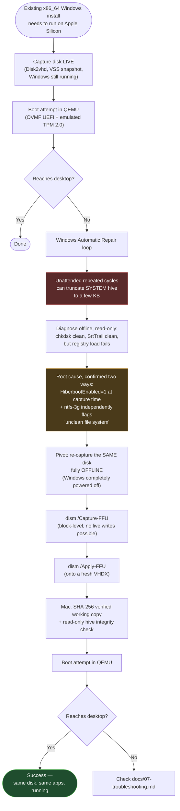

# Diagram: decision flow

Referenced from the [main README](../../README.md) and
[01-problem-and-root-cause.md](../01-problem-and-root-cause.md).

```mermaid
flowchart TD
    Start(["Existing x86_64 Windows install\nneeds to run on Apple Silicon"]) --> Live["Capture disk LIVE\n(Disk2vhd, VSS snapshot,\nWindows still running)"]
    Live --> Boot1["Boot attempt in QEMU\n(OVMF UEFI + emulated TPM 2.0)"]
    Boot1 --> Check1{"Reaches desktop?"}
    Check1 -->|Yes| Done1(["Done"])
    Check1 -->|No| Repair["Windows Automatic Repair loop"]
    Repair --> Danger["Unattended repeated cycles\ncan truncate SYSTEM hive\nto a few KB"]
    Danger --> Diagnose["Diagnose offline, read-only:\nchkdsk clean, SrtTrail clean,\nbut registry load fails"]
    Diagnose --> RootCause["Root cause, confirmed two ways:\nHiberbootEnabled=1 at capture time\n+ ntfs-3g independently flags\n'unclean file system'"]
    RootCause --> Pivot["Pivot: re-capture the SAME disk\nfully OFFLINE\n(Windows completely powered off)"]
    Pivot --> Capture["dism /Capture-FFU\n(block-level, no live writes possible)"]
    Capture --> Apply["dism /Apply-FFU\n(onto a fresh VHDX)"]
    Apply --> WorkCopy["Mac: SHA-256 verified working copy\n+ read-only hive integrity check"]
    WorkCopy --> Boot2["Boot attempt in QEMU"]
    Boot2 --> Check2{"Reaches desktop?"}
    Check2 -->|Yes| Done2(["Success —\nsame disk, same apps, running"])
    Check2 -->|No| Investigate["Check docs/07-troubleshooting.md"]

    style Danger fill:#5a2a2a,stroke:#c66,color:#fff
    style RootCause fill:#4a3a1a,stroke:#c93,color:#fff
    style Done2 fill:#1f4d2e,stroke:#4a4,color:#fff
```
