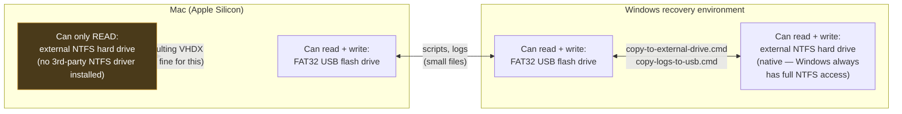

# Diagram: why files hop through a USB flash drive

Referenced from the [main README](../../README.md) and
[04-windows-offline-capture.md](../04-windows-offline-capture.md). Explains
[troubleshooting #6](../07-troubleshooting.md#6-macos-can-read-the-external-ntfs-drive-but-cant-write-to-it).

**The constraint in one sentence:** the Mac can write to the FAT32 USB but not the NTFS external
drive; Windows can write to both. So anything that needs to move *onto* the NTFS drive from the
Mac side (or logs coming back *from* it) makes one extra hop through the USB, with Windows doing
the actual NTFS-side copy on either end.

This is also why the final VHDX itself doesn't need this relay — reading it from the Mac (to copy
it into `IMAGE_DIR`) only requires read access, which macOS's built-in NTFS driver already
provides.
