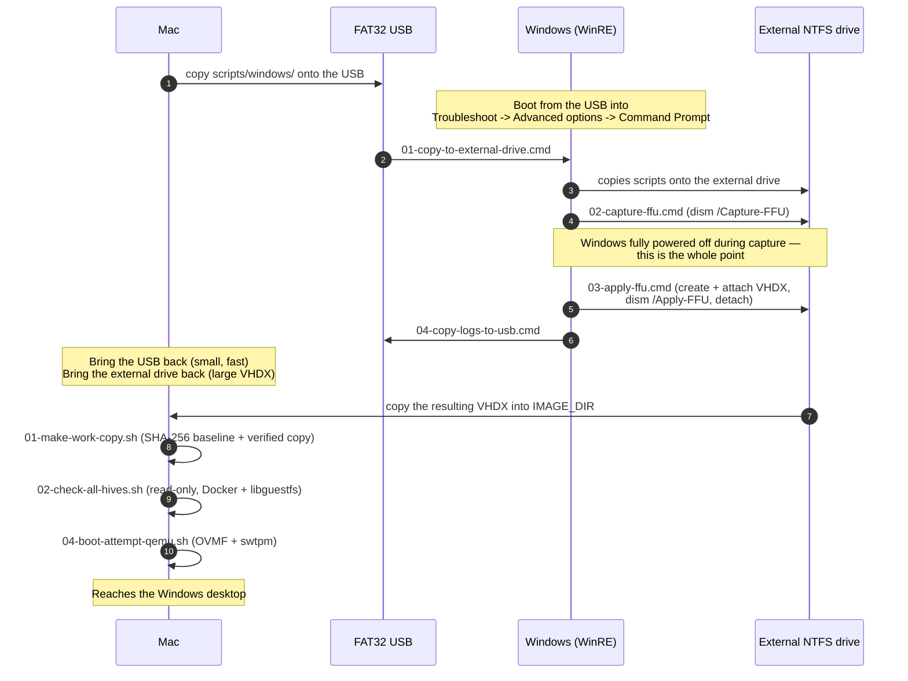

# Diagram: full pipeline sequence

Referenced from the [main README](../../README.md). The detailed version of the sequence diagram
there — every script from both `scripts/mac/` and `scripts/windows/`, in order, across both
machines.

